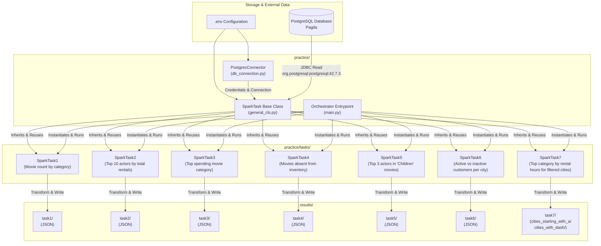
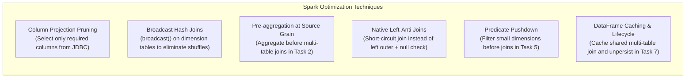
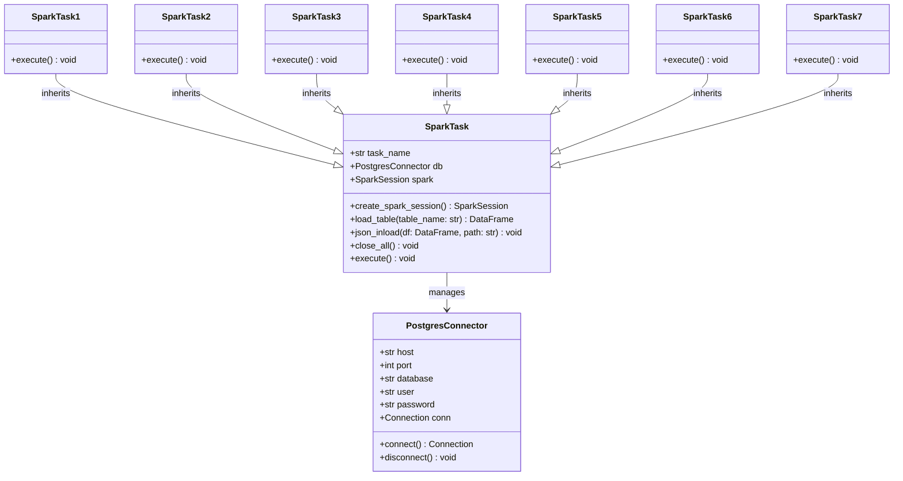

# InnoSpark - PySpark Data Processing Pipeline

A modular, high-performance Apache Spark (PySpark) processing framework designed for batch ETL workloads and analytical queries against the Pagila sample PostgreSQL database.

---

## 1. Architectural Overview

The project follows a **modular, object-oriented ETL pipeline architecture**. Analytical tasks inherit from a centralized base template (`SparkTask`) that encapsulates the `SparkSession` lifecycle, PostgreSQL connectivity via JDBC, table ingestion into distributed DataFrames, and standardized JSON output export.



---

## 2. Core Architectural Components

### 2.1. Application Entrypoint & Orchestration (`practice/main.py`)
- **Centralized Batch Runner**: Sequentially instantiates and executes analytical tasks (`SparkTask1` through `SparkTask7`).
- **Unified Logging**: Sets up standard Python `logging` (`%(asctime)s [%(levelname)s] [%(name)s]: %(message)s`) at root entrypoint to ensure uniform log emission across all execution stages.
- **Resource Safety & Resilience**: Wraps the entire workflow in a `try...except...finally` block. Every instantiated task triggers `close_all()` in the `finally` block, ensuring clean teardown of both `SparkSession` resources and PostgreSQL connection handles regardless of execution outcome.

### 2.2. Base Task Abstraction (`practice/general_cls.py`)
The `SparkTask` class serves as the foundation implementing the **Template Method Pattern**:
- **SparkSession Management**: Automatically configures and retrieves an active `SparkSession` using `.getOrCreate()`, dynamically loading the PostgreSQL JDBC driver (`org.postgresql:postgresql:42.7.3`) via Apache Ivy. JVM internal logs are silenced to `WARN` level to keep logs focused and readable.
- **Database Connectivity**: Integrates with `PostgresConnector` to construct JDBC connection URLs and credentials.
- **Data Ingestion (`load_table`)**: Provides a unified method to read PostgreSQL tables directly into distributed PySpark DataFrames via JDBC.
- **Standardized Export (`json_inload`)**: Persists DataFrames to partitioned JSON files within `practice/.results/{task_name}` (or a custom target path) using overwrite mode.
- **Graceful Teardown (`close_all`)**: Handles shutdown of the `SparkSession` and the underlying database connection.
- **Execution Contract (`execute`)**: Abstract execution contract overridden by each task subclass.

### 2.3. Database Connection Layer (`practice/db_connection.py`)
- **`PostgresConnector`**: Encapsulates connection parameters (`DB_HOST`, `DB_PORT`, `DB_DATABASE`, `DB_USER`, `DB_PASSWORD`) loaded securely from `.env` via `python-dotenv`.
- Provides dedicated connection management via `psycopg2` alongside parameters needed by PySpark JDBC readers.

### 2.4. Task Implementations (`practice/tasks/`)
All seven analytical queries are implemented as dedicated modular subclasses of `SparkTask`:

| Module | Goal & Analytical Query | Key Transformations & Spark Logic | Output Path |
|--------|-------------------------|-----------------------------------|-------------|
| `task_1.py` | Output the number of movies in each category, sorted descending by count, ascending by category name. | Broadcast join on `category` (16 rows) with `film_category`, `groupBy("name")`, `count("film_id")`, `orderBy(desc("movie_count"), col("category"))`. | `.results/task1` |
| `task_2.py` | Output the top 10 actors whose movies rented the most, sorted descending. | Pre-aggregate rental counts by `film_id` via broadcast join with `inventory`, join with broadcasted `film_actor` and `actor`, `groupBy("first_name", "last_name")`, `sum("rental_count")`, `limit(10)`. | `.results/task2` |
| `task_3.py` | Output the category of movies on which the most money was spent. | Multi-table join across `payment`, `rental`, broadcasted `inventory`, `film_category`, and `category`, `groupBy("category")`, `sum("amount")`, `orderBy(desc("total_spent"))`, `limit(1)`. | `.results/task3` |
| `task_4.py` | Output the titles of movies that are not present in inventory. | `left_anti` join between `film` and deduplicated `inventory` on `film_id` with `broadcast(inventory)`, selecting `title`. | `.results/task4` |
| `task_5.py` | Output top 3 actors appearing most in "Children" category movies (including all ties). | Filter `category` to `"Children"` pushed down before join, join with `film_category`, `film_actor`, and broadcasted `actor`, window ranking using `dense_rank().over(orderBy(desc("movie_count")))`, filter `place <= 3`. | `.results/task5` |
| `task_6.py` | Output cities with count of active (`active = 1`) and inactive (`active != 1`) customers, sorted descending by inactive count. | Broadcast joins on `address` and `city` with `customer`, conditional aggregations using `count(when(col("active") == 1, 1))` and `count(when(col("active") != 1, 1))`, `orderBy(desc("inactive_customers"), col("city"))`. | `.results/task6` |
| `task_7.py` | Output the top movie category by total rental hours for: (1) cities starting with "A"/"a", and (2) cities containing a "-". | Calculate `rental_hours = (return_date - rental_date) / 3600`, broadcast join all dimension tables (`inventory`, `film_category`, `category`, `customer`, `address`, `city`), cache intermediate DataFrame (`.cache()`), rank via `dense_rank()`, export both subsets, and unpersist cache. | `.results/task7/cities_starting_with_a`<br>`.results/task7/cities_with_dash` |

---

## 3. Query Optimization & Performance Engineering

All tasks have been optimized to minimize network I/O, JVM memory pressure, and cluster shuffle stages:



1. **Column Projection Pruning**:
   - Rather than pulling full table schemas over JDBC, queries immediately prune columns upon reading (e.g., `self.load_table("film").select("film_id", "title")`).
   - Drastically cuts down PostgreSQL JDBC serialization overhead, network bandwidth consumption, and Spark executor memory footprint.

2. **Broadcast Hash Joins (`broadcast`)**:
   - Small dimension tables (`category`, `actor`, `inventory`, `film_category`, `address`, `city`) are explicitly wrapped with `broadcast()`.
   - Replaces expensive distributed `SortMergeJoin` (which requires hashing and shuffling large datasets across executors) with fast, local in-memory hash lookups.

3. **Pre-aggregation at Source Grain (Task 2)**:
   - In Task 2, `rental` is joined with `inventory` and aggregated by `film_id` before joining with `film_actor` and `actor`.
   - Prevents multiplying millions of intermediate rows through the 4-way join before grouping.

4. **Native Left-Anti Joins (Task 4)**:
   - Replaced conventional `left` join followed by `.where(col(...).isNull())` with PySpark's native `how="left_anti"` join against deduplicated inventory film IDs.
   - Spark executes this as an optimized broadcast anti-hash join, skipping unnecessary column allocations and null-filtering passes.

5. **Predicate Pushdown & Broadcast Filtering (Task 5)**:
   - Pushes down the `"Children"` category filter directly onto the 16-row `category` table before joining, broadcasting a 1-row DataFrame that prunes rows early in the pipeline.

6. **In-Memory DataFrame Caching & Lifecycle Management (Task 7)**:
   - Task 7 requires computing two analytical cuts (cities starting with "A" and cities containing "-") across a 7-table joined pipeline.
   - The joined base DataFrame is cached in memory via `.cache()`, avoiding double-evaluation of the 7-table join. Once both JSON outputs are written, `.unpersist()` is immediately invoked to release memory.

---

## 4. Class Hierarchy & Design Patterns



---

## 5. Execution Lifecycle

1. **Initialization & Setup**:
   - `practice/main.py` is invoked.
   - Root logger is initialized with timestamped formatting.
   - Tasks (`SparkTask1` through `SparkTask7`) are instantiated.
2. **Session & Connection Management**:
   - Base `SparkTask.__init__` reads database parameters via `PostgresConnector` (`.env`).
   - `SparkSession` is configured with PostgreSQL JDBC driver coordinates (`org.postgresql:postgresql:42.7.3`). Subsequent tasks reuse the existing JVM session via `SparkSession.builder.getOrCreate()`.
   - PySpark log level is adjusted to `WARN`.
3. **Execution Phase**:
   - The runner loops over `tasks` and invokes `.execute()` on each instance.
   - `load_table()` loads needed PostgreSQL relations via JDBC.
   - Transformations (joins, window functions, aggregations, broadcasts) execute lazily across Spark executors.
   - `json_inload()` writes output datasets into `practice/.results/<task_name>/`.
4. **Graceful Teardown**:
   - A `finally` block in `main.py` calls `close_all()` on each task.
   - Database connections (`psycopg2`) are closed.
   - The `SparkSession` driver and JVM gateway are cleanly terminated.

---

## 6. Directory Structure

```text
inno_spark/
├── .gitignore                 # Git ignore rules
├── requirements.txt           # Python dependencies (pyspark, psycopg2, etc.)
├── README.md                  # Architecture, task documentation & project guide
└── practice/                  # Core application package
    ├── __init__.py
    ├── main.py                # Application entrypoint & task runner
    ├── general_cls.py         # SparkTask base class (Template Method)
    ├── db_connection.py       # PostgresConnector class
    ├── .results/              # Output directory for exported JSON partitions
    │   ├── task1/             # Task 1 output
    │   ├── task2/             # Task 2 output
    │   ├── task3/             # Task 3 output
    │   ├── task4/             # Task 4 output
    │   ├── task5/             # Task 5 output
    │   ├── task6/             # Task 6 output
    │   └── task7/             # Task 7 output
    │       ├── cities_starting_with_a/
    │       └── cities_with_dash/
    └── tasks/                 # Individual task implementations
        ├── __init__.py        # Exposes SparkTask1 through SparkTask7
        ├── task_1.py          # Movie count by category
        ├── task_2.py          # Top 10 actors by total rentals
        ├── task_3.py          # Top spending movie category
        ├── task_4.py          # Movies absent from inventory
        ├── task_5.py          # Top 3 actors in "Children" movies (dense rank)
        ├── task_6.py          # Active and inactive customer counts per city
        └── task_7.py          # Highest rental hours category for filtered cities
```

---

## 7. Technology Stack

| Component | Technology / Version | Description |
|-----------|----------------------|-------------|
| **Compute Engine** | [Apache Spark (PySpark)](https://spark.apache.org/) `>=4.0.0` | Distributed query execution, DataFrame operations, window functions |
| **Database** | [PostgreSQL (Pagila)](https://www.postgresql.org/) | Relational DVD rental database running locally or in Docker |
| **Driver / Connector** | `org.postgresql:postgresql:42.7.3` | JDBC driver for PySpark PostgreSQL extraction |
| **Database Client** | `psycopg2-binary` `>=2.9.9` | Python PostgreSQL driver for connection management |
| **Configuration** | `python-dotenv` `>=1.0.0` | Environment variable management from `.env` |
| **Data Serialization** | `pyarrow` `>=18.0.0`, `pandas` `>=2.2.0` | Optimized columnar execution and interoperability |

---

## 8. Getting Started

### 8.1. Prerequisites
- **Java**: OpenJDK 17 or 21 (required by Apache Spark)
- **Python**: Python 3.10+
- **Docker & Docker Compose** (optional, for running the database in a container)

### 8.2. Environment Configuration
Create a `.env` file in the project root:

```ini
DB_HOST=...
DB_PORT=...
DB_DATABASE=...
DB_USER=...
DB_PASSWORD=...
```

### 8.3. Python Dependencies Installation
Create and activate a virtual environment, then install dependencies:

```bash
python3 -m venv .venv
source .venv/bin/activate
pip install -r requirements.txt
```

### 8.4. Running the Pipeline
Execute all analytical tasks sequentially from the project root:

```bash
python practice/main.py
```

Results will be exported as JSON files inside `practice/.results/`.

---

## 9. How to Add a New Task

To introduce an additional analytical task into the pipeline:

1. Create a new task module in `practice/tasks/task_X.py`.
2. Inherit from `SparkTask` and implement `.execute()`:
   ```python
   from pyspark.sql.functions import col, broadcast
   from general_cls import SparkTask

   class SparkTaskX(SparkTask):
       def __init__(self) -> None:
           super().__init__("taskX")

       def execute(self) -> None:
           # Apply column pruning at load time
           df = self.load_table("table_name").select("col_a", "col_b")
           # Apply transformations
           result_df = df.filter(col("col_a") > 0)
           # Persist results
           self.json_inload(result_df)
   ```
3. Export the class in `practice/tasks/__init__.py`.
4. Import and append the instance to the `tasks` array in `practice/main.py`.
