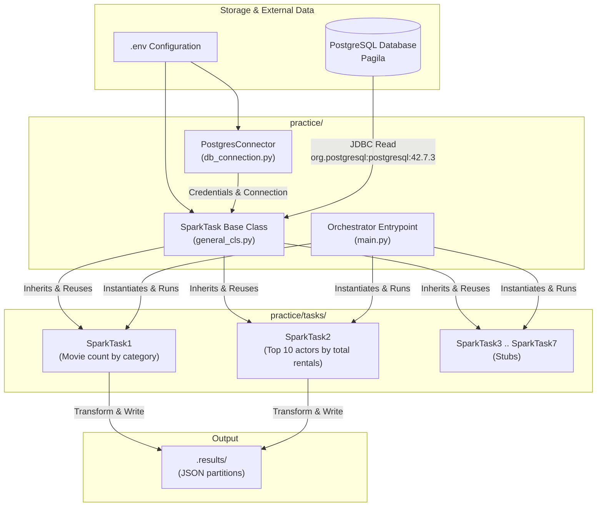
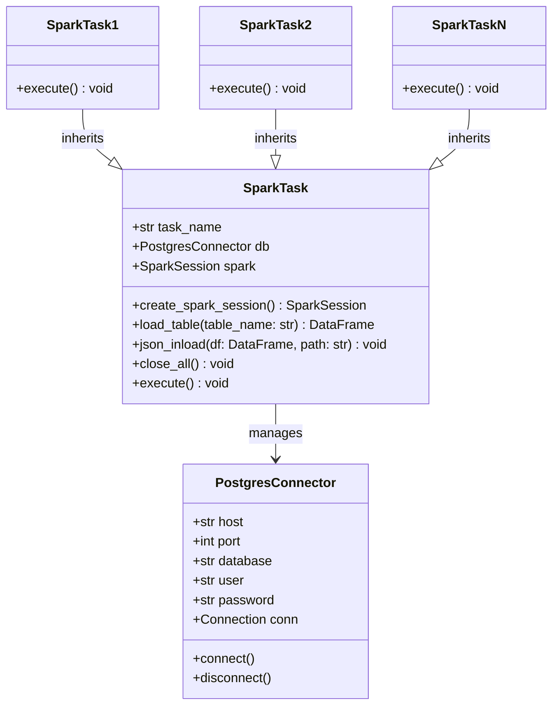

# InnoSpark - PySpark Data Processing Pipeline

A modular Apache Spark (PySpark) processing framework designed for batch ETL workloads and analytical queries against the Pagila sample PostgreSQL database.

---

## 1. Architectural Overview

The project follows a **modular, object-oriented ETL pipeline architecture**. Individual analytical tasks inherit from a base template that encapsulates the `SparkSession` lifecycle, PostgreSQL connectivity via JDBC, table ingestion into distributed DataFrames, and standardized JSON output export.



---

## 2. Core Architectural Components

### 2.1. Application Entrypoint & Orchestration (`practice/main.py`)
- **Centralized Execution**: Orchestrates task execution in a sequential batch workflow.
- **Logging Initialization**: Configures standard Python `logging` (`%(asctime)s [%(levelname)s] [%(name)s]: %(message)s`) at the root entrypoint to ensure consistent logging across all modules.
- **Resilience & Resource Management**: Wraps execution in a `try...except...finally` block. All instantiated tasks execute `close_all()` during the `finally` phase, guaranteeing that database connections and Spark driver resources are released even if a task fails.

### 2.2. Base Task Abstraction (`practice/general_cls.py`)
The `SparkTask` class serves as the core foundation implementing the **Template Method Pattern**:
- **SparkSession Management**: Automatically configures and retrieves an active `SparkSession` using `.getOrCreate()`, with the PostgreSQL JDBC driver (`org.postgresql:postgresql:42.7.3`) loaded via Apache Ivy. JVM internal logs are set to `WARN` level to keep console output clean.
- **Database Connectivity**: Integrates with `PostgresConnector` to construct JDBC connection URLs and credentials.
- **Data Ingestion (`load_table`)**: Provides a unified method to read PostgreSQL tables directly into distributed PySpark DataFrames via JDBC.
- **Data Export (`json_inload`)**: Standardizes DataFrame persistence to partitioned JSON files within `practice/.results/{task_name}` using overwrite mode.
- **Graceful Teardown (`close_all`)**: Handles clean shutdown of the PySpark session and the underlying psycopg2 database connection.
- **Execution Contract (`execute`)**: Defines the interface contract to be overridden by specific subtasks.

### 2.3. Database Connection Layer (`practice/db_connection.py`)
- **`PostgresConnector`**: Encapsulates connection parameters (`DB_HOST`, `DB_PORT`, `DB_DATABASE`, `DB_USER`, `DB_PASSWORD`) loaded securely from `.env` via `python-dotenv`.
- Provides dedicated connection management via `psycopg2` alongside parameters needed by PySpark JDBC readers.

### 2.4. Task Modules (`practice/tasks/`)
- Each task resides in its own module (`task_1.py` through `task_7.py`) and subclasses `SparkTask`.
- **Decoupled Business Logic**: Subclasses isolate their transformation logic inside their `execute()` implementation.
  - **`SparkTask1`**: Performs a join between `category` and `film_category`, aggregates movie counts per category (`groupBy` + `agg`), sorts results descending by count and ascending by name, and outputs JSON partitions to `.results/task1`.
  - **`SparkTask2`**: Computes the top 10 actors whose films were rented the most. Joins `inventory`, `rental`, `film_actor`, and `actor`, aggregates total rentals per actor (`groupBy("first_name", "last_name")` + `agg(sum(...))`), sorts descending by rental count, limits to top 10, and outputs JSON partitions to `.results/task2`.
  - **`SparkTask3` – `SparkTask7`**: Modular skeleton tasks ready for upcoming analytical operations.
- **Package Interface (`__init__.py`)**: Exposes task classes cleanly via `__all__`.

---

## 3. Class Hierarchy & Design Patterns



---

## 4. Execution Lifecycle

1. **Initialization**:
   - `main.py` is invoked.
   - Global logging is configured.
   - Tasks (`SparkTask1` through `SparkTask7`) are instantiated.
2. **Session & Connection Setup**:
   - Base `SparkTask.__init__` instantiates `PostgresConnector` (reading from `.env`).
   - SparkSession is initialized with the PostgreSQL JDBC jar dependency (`org.postgresql:postgresql:42.7.3`). Subsequent task initializations reuse the existing session via `SparkSession.builder.getOrCreate()`.
   - PySpark context log level is tuned to `WARN`.
3. **Execution Phase**:
   - The runner iterates through task instances calling `task.execute()`.
   - `load_table()` pulls required relations from PostgreSQL into Spark DataFrames via JDBC.
   - Transformations (joins, groupings, aggregations, orderings) are lazily evaluated and executed across Spark executors.
   - `json_inload()` writes output datasets into `practice/.results/<task_name>/`.
4. **Cleanup Phase**:
   - The `finally` block in `main.py` invokes `close_all()` on each task.
   - `spark.stop()` terminates the Spark JVM gateway and releases cluster resources.
   - `db.disconnect()` closes the database connection.

---

## 5. Directory Structure

```text
inno_spark/
├── .env                       # Database connection configuration (git-ignored)
├── .gitignore                 # Git ignore rules
├── requirements.txt           # Python dependencies (pyspark, psycopg2, etc.)
├── README.md                  # Architecture and project documentation
├── pagila/                    # Pagila PostgreSQL database schemas and setup
└── practice/                  # Core application package
    ├── __init__.py
    ├── main.py                # Application entrypoint & task runner
    ├── general_cls.py         # SparkTask base class
    ├── db_connection.py       # PostgresConnector class
    ├── .results/              # Generated task results (JSON partitions)
    │   ├── task1/
    │   └── task2/
    └── tasks/                 # Individual task implementations
        ├── __init__.py        # Task exports
        ├── task_1.py          # Task 1: Movie count by category
        ├── task_2.py          # Task 2: Top 10 actors by total rentals
        ├── ...
        └── task_7.py          # Task 7 stub
```

---

## 6. Technology Stack

| Component | Technology / Version | Description |
|-----------|----------------------|-------------|
| **Compute Engine** | [Apache Spark (PySpark)](https://spark.apache.org/) `>=4.0.0` | Distributed query execution and DataFrame processing |
| **Database** | [PostgreSQL (Pagila)](https://www.postgresql.org/) | Relational source database containing the Pagila DVD rental dataset |
| **Driver / Connector** | `org.postgresql:postgresql:42.7.3` | JDBC driver for PySpark PostgreSQL extraction |
| **Database Client** | `psycopg2-binary` `>=2.9.9` | Python PostgreSQL adapter for connection validation and management |
| **Environment Management** | `python-dotenv` `>=1.0.0` | Secure environment variable configuration |
| **Columnar / Data Formats** | `pyarrow` `>=18.0.0`, `pandas` `>=2.2.0` | Supporting libraries for vectorized execution and data conversion |

---

## 7. How to Add a New Task

To introduce a new Spark processing task:

1. Create a new task file in `practice/tasks/task_X.py`.
2. Inherit from `SparkTask`:
   ```python
   from general_cls import SparkTask

   class SparkTaskX(SparkTask):
       def __init__(self) -> None:
           super().__init__("taskX")

       def execute(self) -> None:
           df = self.load_table("table_name")
           # Apply transformations
           self.json_inload(df)
   ```
3. Register the class in `practice/tasks/__init__.py`.
4. Import and append the instance to the `tasks` list in `practice/main.py`.
